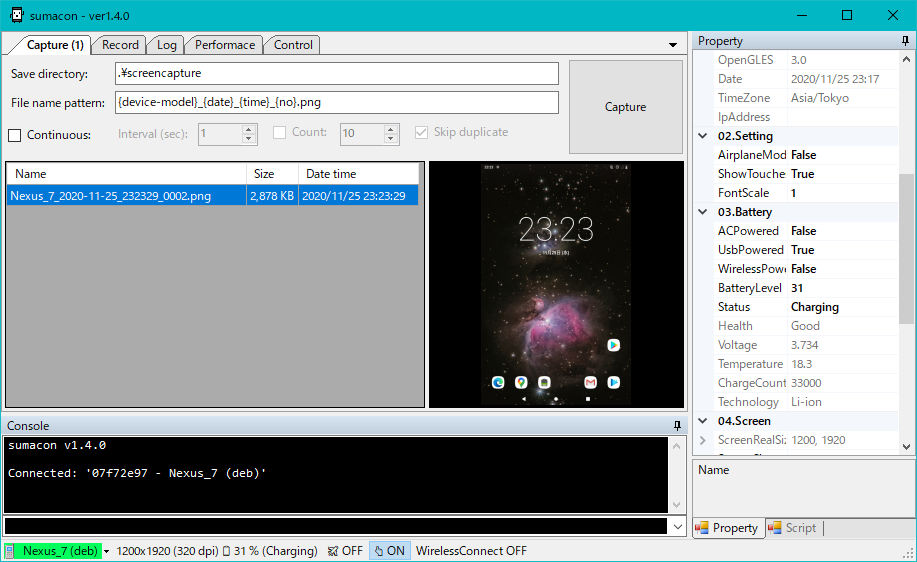

# sumacon

This is GUI utility for Android device that works on Windows desktop.  
It communicate with adb (Android Debug Bridge) internally.

## Features

* Viewing logs/system info
* Screen capture/recording
* Change properties
* Control form PC

## Screenshots

## Lisence

MIT License
